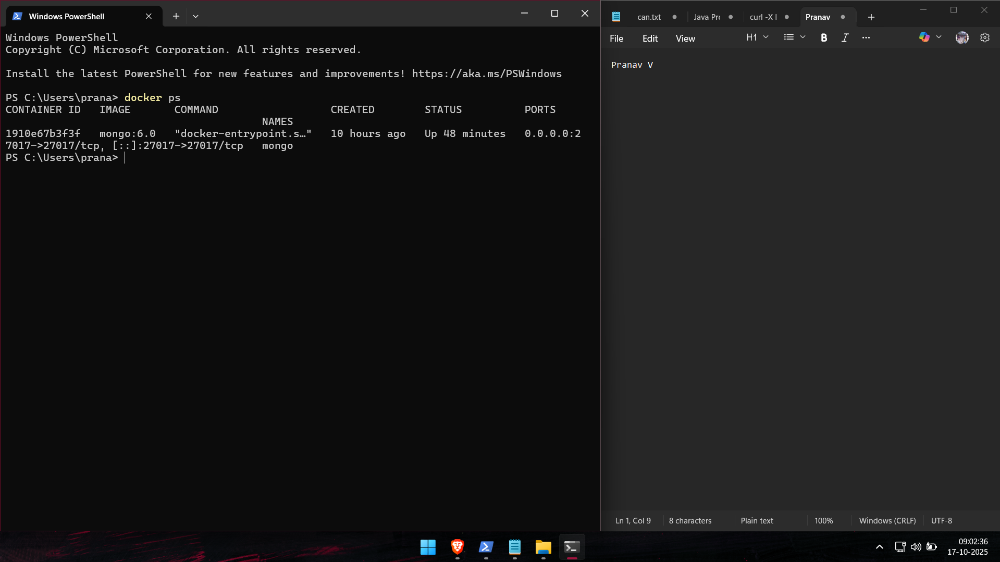
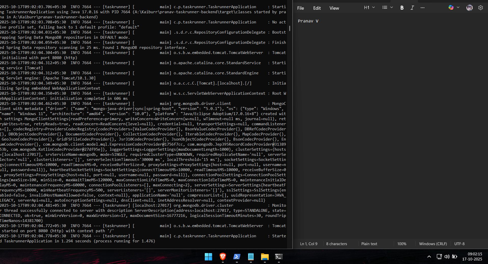
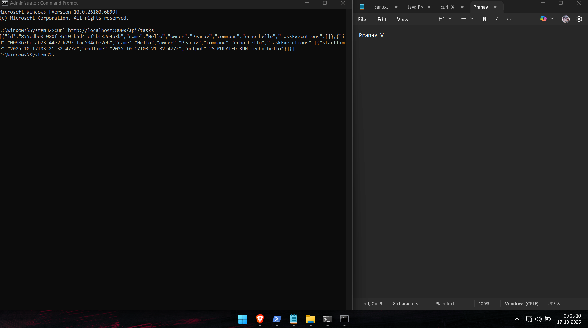
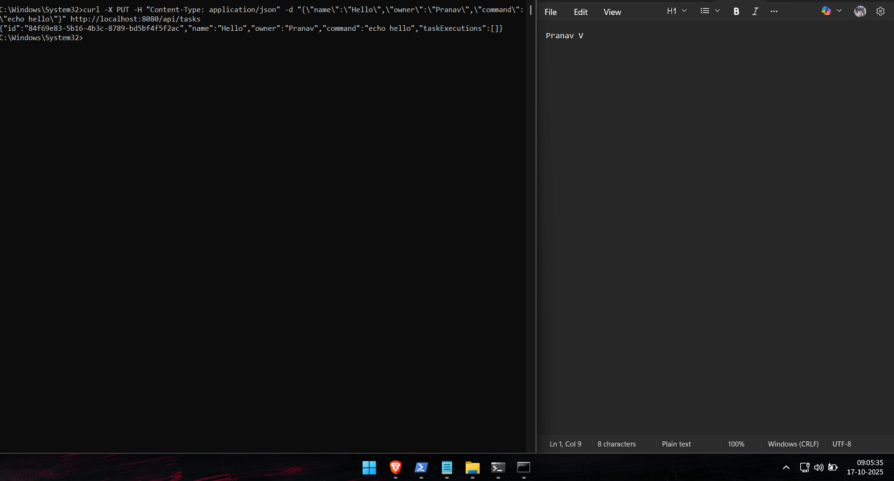
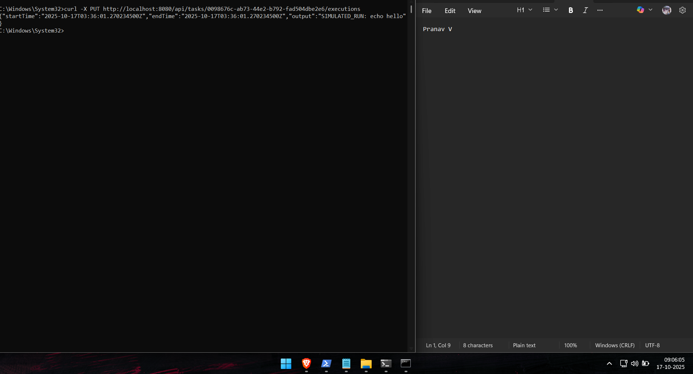

## 📸 Screenshots (With Date & Name)

| Step | Description | Screenshot |
|------|--------------|-------------|
| 1 | Mongo container running |  |
| 2 | Spring Boot app running |  |
| 3 | Tasks list (after creation & execution) |  |
| 4 | Task created |  |
| 5 | Execution simulated |  |


## ⚙️ Task 2 – Kubernetes Pod Execution (Fabric8 Client)

### 🧠 Overview
This phase extends the backend to execute task commands inside a **real Kubernetes pod** using the Fabric8 Java Client.  
Each execution dynamically creates a short-lived BusyBox pod, runs the task’s command, retrieves logs, and then deletes the pod.

### 🧰 Steps to Run
```bash
# 1. Ensure Minikube is running
minikube start

# 2. Verify cluster
kubectl get nodes

# 3. Run the backend
mvn spring-boot:run

# 4. Execute a task
curl -X PUT http://localhost:8080/api/tasks/<task-id>/executions

```## ⚙️ Task 3 – Kubernetes Deployment (Minikube)

### 🧠 Overview
The Spring Boot backend is containerized using Docker and deployed in Minikube along with MongoDB.
The setup uses a Deployment + Service pattern for both components and exposes the API through NodePort 30080.

# 1. Package the Spring Boot app
mvn clean package -DskipTests

# 2. Point Docker to Minikube's internal daemon
& minikube -p minikube docker-env | Invoke-Expression

# 3. Build image inside Minikube
docker build -t taskrunner-backend:latest .

# 4. Apply Kubernetes manifests
kubectl apply -f k8s/mongo-deployment.yml
kubectl apply -f k8s/taskrunner-deployment.yml

# 5. Verify
kubectl get pods
kubectl get svc

# 6. Access the service
minikube service taskrunner-service --url

